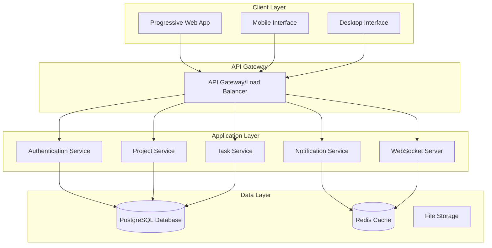
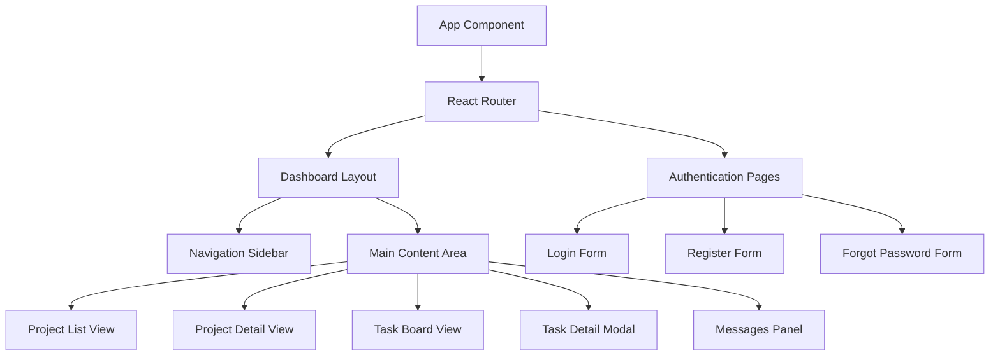

# Design Document

## Overview

SynergySphere MVP is designed as a modern, cross-platform team collaboration platform that provides seamless experiences across mobile and desktop devices. The architecture emphasizes real-time collaboration, efficient data management, and responsive user interfaces. The system follows a client-server architecture with a RESTful API backend, real-time WebSocket connections for live updates, and progressive web app (PWA) technology for cross-platform compatibility.

The platform is built around the concept of being a "central nervous system" for teams, providing proactive insights and seamless collaboration tools that adapt to how teams naturally work.

## Architecture

### High-Level Architecture



### Technology Stack

**Frontend:**
- **Framework:** React with TypeScript for type safety and maintainability
- **Cross-Platform:** Progressive Web App (PWA) with responsive design
- **State Management:** Redux Toolkit for predictable state management
- **Real-time:** Socket.io client for WebSocket connections
- **UI Framework:** Material-UI (MUI) with custom theming for consistent design
- **Build Tool:** Vite for fast development and optimized builds

**Backend:**
- **Runtime:** Node.js with Express.js framework
- **Language:** TypeScript for type safety across the stack
- **Database:** PostgreSQL for relational data with ACID compliance
- **Caching:** Redis for session management and real-time data
- **Real-time:** Socket.io for WebSocket connections
- **Authentication:** JWT tokens with refresh token rotation

**Infrastructure:**
- **Containerization:** Docker for consistent deployment environments
- **Reverse Proxy:** Nginx for load balancing and static file serving
- **File Storage:** Local filesystem with future cloud storage migration path

## Components and Interfaces

### Core Components

#### 1. Authentication System
**Purpose:** Secure user registration, login, and session management

**Key Features:**
- JWT-based authentication with refresh tokens
- Password hashing using bcrypt
- Session management with Redis
- Password reset functionality via email

**API Endpoints:**
```typescript
POST /api/auth/register
POST /api/auth/login
POST /api/auth/logout
POST /api/auth/refresh
POST /api/auth/forgot-password
POST /api/auth/reset-password
```

#### 2. Project Management System
**Purpose:** Create, manage, and organize team projects

**Key Features:**
- Project CRUD operations
- Team member invitation and management
- Project-level permissions and roles
- Project statistics and analytics

**API Endpoints:**
```typescript
GET /api/projects
POST /api/projects
GET /api/projects/:id
PUT /api/projects/:id
DELETE /api/projects/:id
POST /api/projects/:id/members
DELETE /api/projects/:id/members/:userId
```

#### 3. Task Management System
**Purpose:** Create, assign, and track tasks within projects

**Key Features:**
- Task CRUD operations with rich metadata
- Status tracking (To-Do, In Progress, Done)
- Assignment and due date management
- Task filtering and sorting capabilities

**API Endpoints:**
```typescript
GET /api/projects/:projectId/tasks
POST /api/projects/:projectId/tasks
GET /api/tasks/:id
PUT /api/tasks/:id
DELETE /api/tasks/:id
PATCH /api/tasks/:id/status
```

#### 4. Communication System
**Purpose:** Enable project-specific threaded discussions

**Key Features:**
- Message threading and replies
- Real-time message delivery
- Message history and search
- @mention functionality with notifications

**API Endpoints:**
```typescript
GET /api/projects/:projectId/messages
POST /api/projects/:projectId/messages
GET /api/messages/:id/replies
POST /api/messages/:id/replies
```

#### 5. Notification System
**Purpose:** Deliver timely updates and alerts to users

**Key Features:**
- Real-time push notifications via WebSocket
- Email notifications for critical events
- Notification preferences management
- Notification history and read status

**API Endpoints:**
```typescript
GET /api/notifications
PATCH /api/notifications/:id/read
PUT /api/notifications/preferences
```

### Frontend Component Architecture



## Data Models

### User Model
```typescript
interface User {
  id: string;
  email: string;
  name: string;
  avatar?: string;
  createdAt: Date;
  updatedAt: Date;
  lastLoginAt?: Date;
  notificationPreferences: NotificationPreferences;
}

interface NotificationPreferences {
  emailNotifications: boolean;
  pushNotifications: boolean;
  taskAssignments: boolean;
  projectUpdates: boolean;
  mentions: boolean;
}
```

### Project Model
```typescript
interface Project {
  id: string;
  name: string;
  description?: string;
  ownerId: string;
  createdAt: Date;
  updatedAt: Date;
  members: ProjectMember[];
  settings: ProjectSettings;
}

interface ProjectMember {
  userId: string;
  role: 'owner' | 'admin' | 'member';
  joinedAt: Date;
}

interface ProjectSettings {
  isPublic: boolean;
  allowMemberInvites: boolean;
}
```

### Task Model
```typescript
interface Task {
  id: string;
  title: string;
  description?: string;
  status: 'todo' | 'in_progress' | 'done';
  priority: 'low' | 'medium' | 'high';
  projectId: string;
  assigneeId?: string;
  creatorId: string;
  dueDate?: Date;
  createdAt: Date;
  updatedAt: Date;
  completedAt?: Date;
}
```

### Message Model
```typescript
interface Message {
  id: string;
  content: string;
  projectId: string;
  authorId: string;
  parentId?: string; // For threaded replies
  mentions: string[]; // User IDs mentioned in message
  createdAt: Date;
  updatedAt: Date;
  editedAt?: Date;
}
```

### Notification Model
```typescript
interface Notification {
  id: string;
  userId: string;
  type: 'task_assigned' | 'task_due' | 'mention' | 'project_update';
  title: string;
  message: string;
  data: Record<string, any>; // Additional context data
  isRead: boolean;
  createdAt: Date;
}
```

## Error Handling

### API Error Response Format
```typescript
interface ApiError {
  error: {
    code: string;
    message: string;
    details?: Record<string, any>;
    timestamp: string;
  };
}
```

### Error Categories
1. **Authentication Errors (401):** Invalid credentials, expired tokens
2. **Authorization Errors (403):** Insufficient permissions
3. **Validation Errors (400):** Invalid input data, missing required fields
4. **Not Found Errors (404):** Resource doesn't exist
5. **Conflict Errors (409):** Duplicate resources, constraint violations
6. **Server Errors (500):** Internal server errors, database connection issues

### Frontend Error Handling Strategy
- Global error boundary for React component errors
- Axios interceptors for API error handling
- Toast notifications for user-facing errors
- Retry mechanisms for transient failures
- Offline detection and graceful degradation

## Testing Strategy

### Backend Testing
1. **Unit Tests:** Individual service and utility function testing
2. **Integration Tests:** API endpoint testing with test database
3. **End-to-End Tests:** Complete user workflow testing
4. **Performance Tests:** Load testing for concurrent users

### Frontend Testing
1. **Component Tests:** React component rendering and interaction testing
2. **Integration Tests:** Component integration and state management testing
3. **E2E Tests:** Full user journey testing with Cypress
4. **Accessibility Tests:** WCAG compliance testing

### Testing Tools
- **Backend:** Jest, Supertest, Artillery (load testing)
- **Frontend:** Jest, React Testing Library, Cypress
- **Database:** Test containers for isolated database testing

### Continuous Integration
- Automated test execution on pull requests
- Code coverage reporting with minimum thresholds
- Performance regression testing
- Security vulnerability scanning

## Real-Time Features Implementation

### WebSocket Event Types
```typescript
// Task-related events
'task:created' | 'task:updated' | 'task:deleted' | 'task:assigned'

// Project-related events  
'project:updated' | 'project:member_added' | 'project:member_removed'

// Message-related events
'message:created' | 'message:updated' | 'message:deleted'

// Notification events
'notification:created' | 'notification:read'

// Presence events
'user:online' | 'user:offline' | 'user:typing'
```

### Real-Time Data Synchronization
- Optimistic updates for immediate UI feedback
- Conflict resolution for concurrent edits
- Event sourcing for audit trails
- Connection recovery and message queuing for offline scenarios

## Security Considerations

### Authentication & Authorization
- JWT tokens with short expiration times
- Refresh token rotation for enhanced security
- Role-based access control (RBAC) for projects
- Rate limiting on authentication endpoints

### Data Protection
- Input validation and sanitization
- SQL injection prevention with parameterized queries
- XSS protection with Content Security Policy
- HTTPS enforcement for all communications

### API Security
- CORS configuration for allowed origins
- Request size limits to prevent DoS attacks
- API rate limiting per user/IP
- Audit logging for sensitive operations

## Performance Optimization

### Database Optimization
- Proper indexing on frequently queried columns
- Connection pooling for efficient database connections
- Query optimization and N+1 problem prevention
- Database query caching with Redis

### Frontend Optimization
- Code splitting for reduced initial bundle size
- Lazy loading of non-critical components
- Image optimization and lazy loading
- Service worker for offline functionality and caching

### Caching Strategy
- Redis for session data and frequently accessed information
- Browser caching for static assets
- API response caching for read-heavy operations
- CDN integration for global content delivery