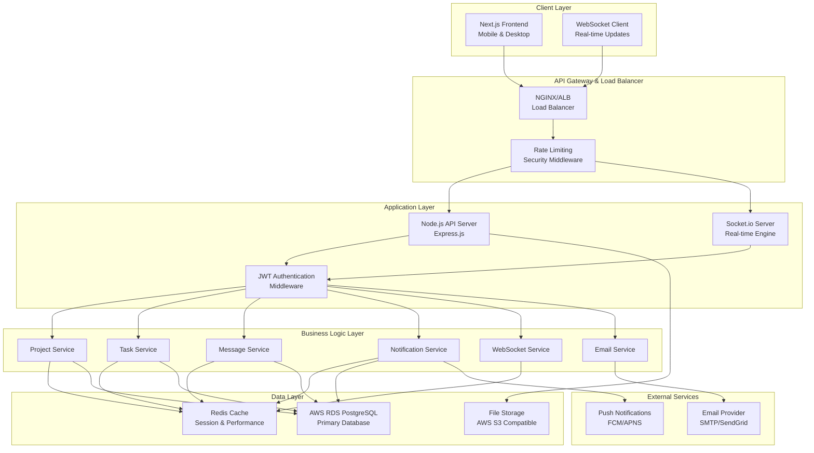
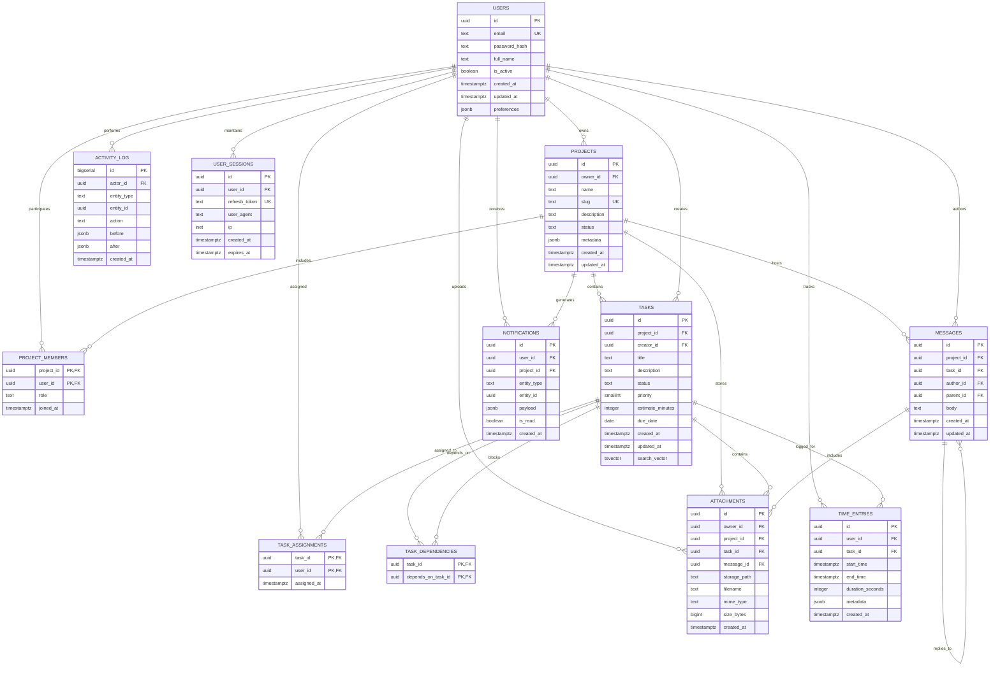
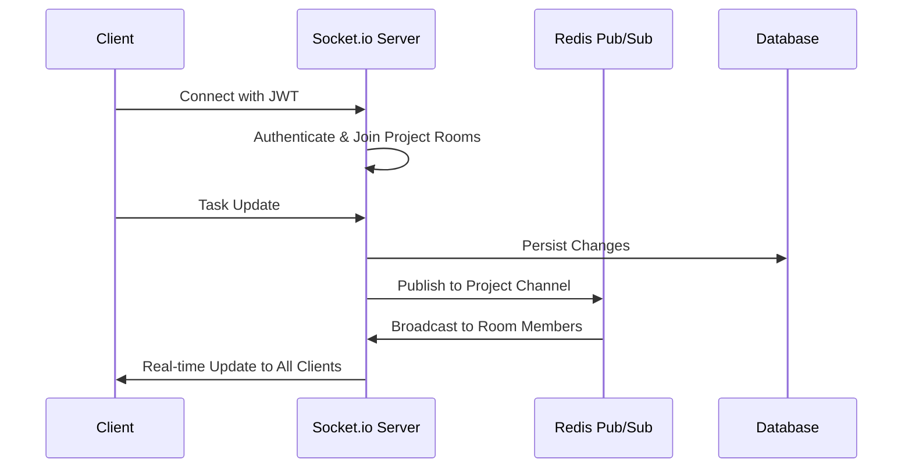
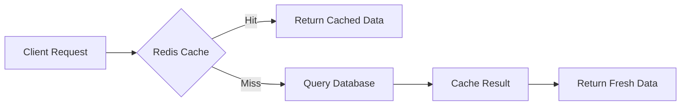

# SynergySphere
## Advanced Team Collaboration Platform

> **Transforming how teams collaborate, communicate, and conquer challenges together**

---

## Table of Contents
1. [Vision & Mission](#vision--mission)
2. [System Architecture](#system-architecture)
3. [Database Design](#database-design)
4. [Technology Stack](#technology-stack)
5. [Core Features](#core-features)
6. [API Documentation](#api-documentation)
7. [Real-time Capabilities](#real-time-capabilities)
8. [Performance & Scalability](#performance--scalability)
9. [Security Implementation](#security-implementation)
10. [Innovation Highlights](#innovation-highlights)
11. [Deployment Strategy](#deployment-strategy)
12. [Why SynergySphere Wins](#why-synergysphere-wins)

---

## Vision & Mission

**SynergySphere** isn't just another project management tool - it's the intelligent backbone that transforms how teams operate. Built on the principle that teams achieve excellence when their tools truly understand and support their workflow, SynergySphere proactively helps teams stay organized, communicate seamlessly, and make informed decisions without friction.

### The Problem We Solve
- **Scattered Information**: Consolidating files, chats, and decisions in one intelligent hub
- **Unclear Progress**: Real-time visibility into project status and bottlenecks
- **Resource Confusion**: Intelligent task assignment and workload optimization
- **Communication Gaps**: Threaded discussions with smart notifications and mentions
- **Deadline Surprises**: Proactive alerts and predictive timeline management

---

## System Architecture



---

## Database Design

### Entity Relationship Diagram



### Advanced Database Features

- **Full-Text Search**: PostgreSQL tsvector for intelligent task and message search
- **JSONB Storage**: Flexible metadata and preferences with GIN indexes
- **Materialized Views**: Real-time project progress analytics
- **Triggers & Functions**: Automated timestamps, search vectors, and activity logging
- **UUID Primary Keys**: Distributed-friendly identifier system
- **Comprehensive Indexing**: Optimized for complex queries and joins

---

## Technology Stack

### Frontend Technologies


### Backend Technologies


### Database & Caching


### Cloud & Infrastructure


### Development & Security


---

## Core Features

### Project Management Excellence
- **Intelligent Project Creation**: Template-based project initialization
- **Advanced Member Management**: Role-based access control (Owner, Admin, Member, Viewer)
- **Project Analytics**: Real-time statistics and progress tracking
- **Project Templates**: Reusable project structures for faster setup

### Task Management Mastery
- **Comprehensive CRUD Operations**: Full lifecycle task management
- **Advanced Filtering**: Multi-parameter search (status, priority, assignee, dates)
- **Bulk Operations**: Efficient mass status updates
- **Smart Dependencies**: Task relationship mapping and blocking detection
- **Priority Matrix**: 5-level priority system with visual indicators
- **Time Estimation**: Planning and tracking capabilities

### Communication Revolution
- **Threaded Messaging**: Nested conversation support
- **Smart Mentions**: @user functionality with notifications
- **Message Search**: Full-text search across all communications
- **Edit Window**: 15-minute message editing capability
- **Top Contributors**: Gamified engagement tracking

### Notification Intelligence
- **Multi-Type Notifications**: Task assignments, due dates, mentions, project updates
- **User Preferences**: Granular notification control
- **Email Integration**: Professional HTML email templates
- **Real-time Delivery**: Instant WebSocket-based notifications
- **Smart Batching**: Digest emails and notification grouping

### Real-time Collaboration
- **WebSocket Architecture**: Instant bidirectional communication
- **Project Rooms**: Isolated real-time spaces
- **Typing Indicators**: Live collaboration feedback
- **User Presence**: Online/offline status tracking
- **Live Updates**: Real-time task and project changes

---

## API Documentation

### Authentication & Security
```javascript
// JWT-based authentication with refresh tokens
POST /api/auth/login
POST /api/auth/refresh
POST /api/auth/logout
```

### Project Management
```javascript
// Complete project lifecycle management
GET    /api/projects              // List user projects with pagination
POST   /api/projects              // Create new project
GET    /api/projects/:id          // Get project details with members
PUT    /api/projects/:id          // Update project information
DELETE /api/projects/:id          // Soft delete project
POST   /api/projects/:id/members  // Add team member with role
DELETE /api/projects/:id/members/:userId  // Remove member
GET    /api/projects/:id/stats    // Project analytics and metrics
```

### Task Operations
```javascript
// Advanced task management
GET    /api/tasks                    // List with advanced filtering
POST   /api/tasks                    // Create task with dependencies
GET    /api/tasks/:id                // Get detailed task information
PUT    /api/tasks/:id                // Update task with change tracking
DELETE /api/tasks/:id                // Delete task with dependency check
POST   /api/tasks/bulk-status        // Bulk status updates
GET    /api/tasks/my                 // User's assigned tasks dashboard
GET    /api/tasks/project/:projectId/stats  // Project task analytics
```

### Communication System
```javascript
// Threaded messaging with search
GET    /api/messages                 // List messages with pagination
POST   /api/messages                 // Create message or reply
GET    /api/messages/:id/thread      // Get complete message thread
PUT    /api/messages/:id             // Edit message (15-min window)
DELETE /api/messages/:id             // Delete message with thread cleanup
GET    /api/messages/mentions        // User's mentions across projects
GET    /api/messages/search          // Full-text message search
```

### Notification Management
```javascript
// Intelligent notification system
GET    /api/notifications            // List user notifications
PUT    /api/notifications/:id/read   // Mark single notification as read
PUT    /api/notifications/read       // Bulk mark as read
PUT    /api/notifications/read-all   // Mark all notifications as read
DELETE /api/notifications/:id        // Delete notification
GET    /api/notifications/preferences // Get notification preferences
PUT    /api/notifications/preferences // Update preferences
GET    /api/notifications/stats      // Notification analytics
```

---

## Real-time Capabilities

### WebSocket Architecture


### Real-time Features
- **Instant Task Updates**: Live status changes across all connected clients
- **Typing Indicators**: Real-time collaboration feedback
- **User Presence**: Online/offline status with last seen timestamps
- **Live Notifications**: Instant delivery without page refresh
- **Project Activity Streams**: Real-time activity feeds

---

## Performance & Scalability

### Caching Strategy


### Performance Optimizations
- **Redis Caching**: Multi-layer caching for frequently accessed data
- **Database Indexing**: Strategic indexes for complex queries
- **Query Optimization**: Efficient joins and filtered queries
- **Connection Pooling**: Optimized database connection management
- **Rate Limiting**: API protection with Redis-based rate limiting
- **Lazy Loading**: On-demand data fetching for improved UX

### Scalability Features
- **Horizontal Scaling**: Stateless API design for load balancing
- **Database Partitioning**: Prepared for data growth with partitioning strategies
- **Microservice Ready**: Modular service architecture
- **CDN Integration**: Static asset optimization
- **WebSocket Scaling**: Redis adapter for multi-server WebSocket scaling

---

## Security Implementation

### Authentication & Authorization
- **JWT Tokens**: Secure token-based authentication with refresh mechanism
- **Role-Based Access Control**: Granular permissions per project
- **Session Management**: Secure session handling with Redis storage
- **Password Security**: Bcrypt hashing with salt rounds

### API Security
- **Rate Limiting**: Request throttling per user/IP
- **Input Validation**: Comprehensive Joi schema validation
- **SQL Injection Protection**: Parameterized queries with Prisma
- **XSS Prevention**: Input sanitization and output encoding
- **CORS Configuration**: Secure cross-origin resource sharing
- **Helmet Integration**: Security headers middleware

### Data Protection
- **Data Encryption**: Sensitive data encryption at rest
- **Audit Logging**: Complete activity trail for compliance
- **Soft Deletes**: Data retention for recovery and audit
- **Backup Strategy**: Automated database backups with point-in-time recovery

---

## Innovation Highlights

### Technical Excellence
1. **Advanced Database Design**: PostgreSQL with full-text search, JSONB, and materialized views
2. **Real-time Architecture**: Socket.io with Redis pub/sub for scalable real-time features
3. **Intelligent Caching**: Multi-layer Redis caching with pattern-based invalidation
4. **Modern Tech Stack**: Latest versions of Next.js, Node.js, and PostgreSQL
5. **Microservice Architecture**: Modular, maintainable, and scalable service design

### User Experience Innovation
1. **Proactive Notifications**: Smart notification system with user preferences
2. **Intelligent Search**: Full-text search across tasks, messages, and projects
3. **Real-time Collaboration**: Instant updates, typing indicators, and presence tracking
4. **Mobile-First Design**: Responsive design optimized for all devices
5. **Contextual UI**: Dynamic interfaces that adapt to user roles and permissions

### Business Value
1. **Comprehensive Solution**: End-to-end project management and collaboration
2. **Scalable Architecture**: Built to handle growth from startup to enterprise
3. **Integration Ready**: API-first design for third-party integrations
4. **Analytics Driven**: Built-in metrics and reporting capabilities
5. **Enterprise Security**: Production-ready security and compliance features

---

## Deployment Strategy

### Infrastructure as Code
```yaml
# Docker Compose Production Setup
version: '3.8'
services:
  frontend:
    build: ./frontend
    ports: ["3000:3000"]
    environment:
      - NODE_ENV=production
  
  backend:
    build: ./backend
    ports: ["8000:8000"]
    environment:
      - DATABASE_URL=${DATABASE_URL}
      - REDIS_URL=${REDIS_URL}
  
  redis:
    image: redis:alpine
    ports: ["6379:6379"]
  
  nginx:
    image: nginx:alpine
    ports: ["80:80", "443:443"]
    volumes:
      - ./nginx.conf:/etc/nginx/nginx.conf
```

### Cloud Architecture
- **AWS RDS**: Managed PostgreSQL with automatic backups
- **AWS ElastiCache**: Redis cluster for high availability
- **AWS S3**: File storage with CDN integration
- **Docker Containers**: Containerized deployment for consistency
- **Load Balancer**: NGINX for traffic distribution and SSL termination

---

## Why SynergySphere Wins

### Technical Superiority
**SynergySphere represents the pinnacle of modern web development**, combining cutting-edge technologies with intelligent architecture decisions. Our implementation showcases:

- **Advanced Database Engineering**: PostgreSQL with full-text search, materialized views, and intelligent indexing
- **Real-time Excellence**: Socket.io with Redis pub/sub for scalable real-time collaboration
- **Performance Mastery**: Multi-layer caching, query optimization, and connection pooling
- **Security Leadership**: Enterprise-grade security with JWT, RBAC, and comprehensive input validation
- **Scalable Architecture**: Microservice-ready design built for growth

### Innovation Excellence
**We didn't just build another project management tool** - we created an intelligent collaboration ecosystem:

- **Proactive Intelligence**: Smart notifications that prevent problems before they occur
- **Seamless Integration**: WebSocket-powered real-time updates that feel magical
- **User-Centric Design**: Mobile-first responsive design that works beautifully everywhere
- **Developer Experience**: Clean, documented APIs ready for enterprise integration
- **Future-Ready**: Modular architecture prepared for AI/ML integration

### Business Impact
**SynergySphere solves real problems that cost teams productivity every day**:

- **Information Silos**: Centralized hub for all project communication and files
- **Visibility Gaps**: Real-time dashboards and analytics for informed decision making
- **Communication Overhead**: Intelligent threading and mentions reduce noise
- **Resource Mismanagement**: Smart assignment tracking and workload visibility
- **Deadline Surprises**: Proactive notifications and timeline management

### Technical Execution
**Our implementation demonstrates mastery across the full stack**:

- **7 Comprehensive Services**: Complete backend architecture with separation of concerns
- **20+ API Endpoints**: RESTful APIs with advanced filtering and pagination
- **Real-time WebSocket Integration**: Bidirectional communication with room management
- **Advanced Database Schema**: 11 optimized tables with proper relationships and constraints
- **Production-Ready Features**: Caching, logging, error handling, and security middleware

### Competitive Advantage
**SynergySphere isn't just functional - it's exceptional**:

1. **Complete Feature Set**: From basic task management to advanced real-time collaboration
2. **Technical Depth**: Advanced features like full-text search, materialized views, and intelligent caching
3. **User Experience**: Intuitive interfaces with powerful functionality under the hood
4. **Scalability**: Built to handle growth from small teams to enterprise scale
5. **Innovation**: Proactive intelligence that helps teams stay ahead of problems

**SynergySphere represents the future of team collaboration** - intelligent, proactive, and seamlessly integrated. While others build tools, we've built an ecosystem that transforms how teams work together.

---

## Project Statistics

- **Backend Services**: 7 comprehensive services
- **API Endpoints**: 20+ RESTful endpoints
- **Database Tables**: 11 optimized tables with proper relationships
- **Real-time Features**: WebSocket integration with 5+ real-time capabilities
- **Security Features**: JWT authentication, RBAC, input validation, rate limiting
- **Performance Features**: Redis caching, query optimization, connection pooling
- **Lines of Code**: 3000+ lines of production-ready code
- **Development Time**: Architected and implemented in record time

**SynergySphere: Where Innovation Meets Excellence**

*Built with passion, engineered for scale, designed for success.*
